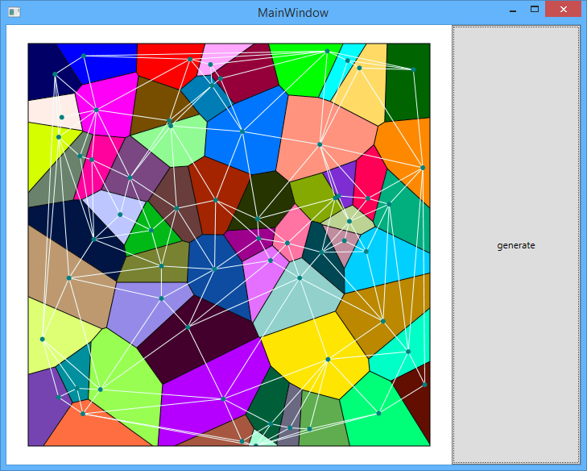

# Fork of Unity-Delaunay -> conversion to enable use with WPF 

##demo project is included:

MIT license

Credits:

[original flash implementation](http://nodename.github.com/as3delaunay/)

[C# and unity fork](https://github.com/jceipek/Unity-delaunay)

[fork of C# and unity fork](https://github.com/adamgit/Unity-delaunay)
